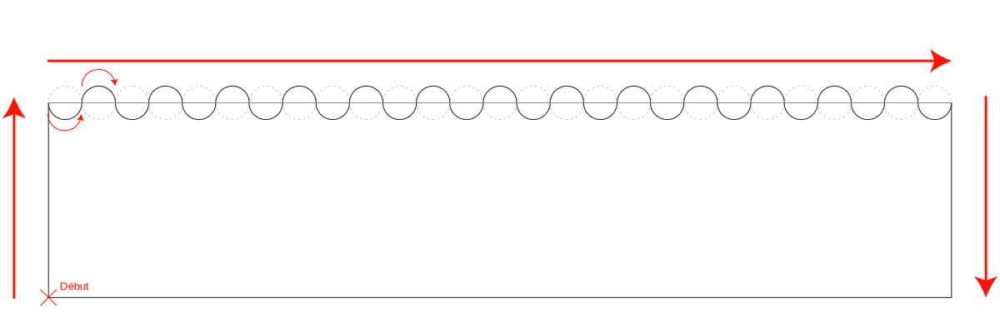
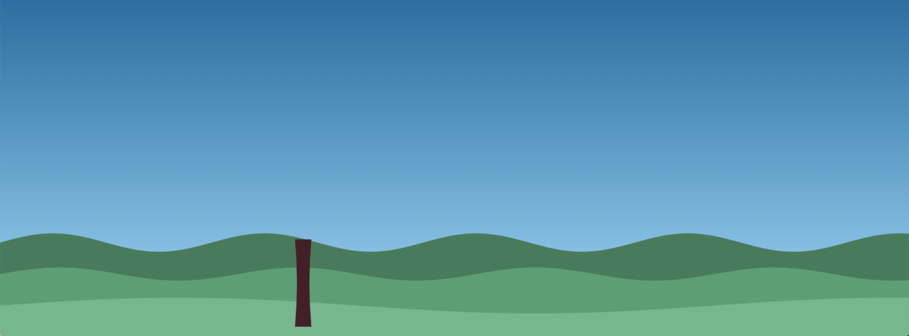
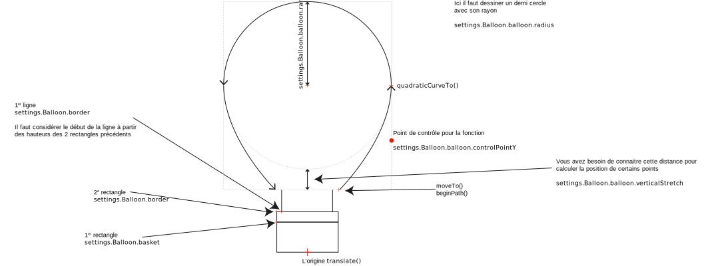

# Vol en montgolfière

> A JS exercise use at HEPL for MMI.

* * *

**hot-air-balloon** is an educational project, which will be used for `JS` courses.

**Note:** the school where the course is given, the [HEPL](https://hepl.be) from Liège, Belgium, is a French-speaking school. From this point, the instruction will be in French. Sorry.

* * *

Vous pouvez voir le projet [ici](https://hepl-mmi.github.io/hot-air-balloon) 

## Énoncé

Dans un premier temps, il est nécessaire de dessiner les différentes parties du jeu. Au début, il peut être intéressant de travailler avec des valeurs simples que vous écrivez en dur dans votre code. Pensez toujours à simplifier votre problème.

## Dessiner les éléments du jeu

1. Mettez à jour les dimensions du canvas, il doit prendre toute la place disponible dans la fenêtre. Ceci doit fonctionner aussi au redimensionnement de la fenêtre. 
2. Commencez par dessiner le ciel. Il s'agit d'un simple dégradé. Les couleurs sont définies dans le fichier `settings.ts`. 
3. Poursuivez en dessinant les talus. Dessinez une forme à l'aide d'un chemin comme vous pouvez le voir dans le schéma. Bien entendu, vous devrez, pour dessiner la courbe, vous servir de la fonction *sinus* ou *cosinus*. L'idée étant de parcourir pixel par pixel la longueur du canvas. Vous devrez vous servir des fonctions `moveTo`, `lineTo` et `fill`. Une fois que vous parvenez à dessiner ceci alors, voyez comment moduler cette courbe. Pour se faire, il suffit de passer des  valeurs plus petites à la fonction *sinus*. Puis d’augmenter le résultat, renvoyé par la fonction *sinus*, par une multiplication.
4. Essayez maintenant de dessiner le tronc d'un arbre. Mais avant de le dessiner, il est nécessaire d'aller lire la page de documentation de la fonction [quadraticCurveTo()](https://developer.mozilla.org/fr/docs/Web/API/CanvasRenderingContext2D/quadraticCurveTo). Peut-être est-il même intéressant de tester un peu cette fonction afin de bien comprendre comment elle fonctionne. Une fois que vous avez compris le rôle de chaque paramètre, vous devriez, en vous aidant de ce schéma, pouvoir dessiner le tronc. 
5. Maintenant, il ne vous reste plus qu'à dessiner la couronne de l'arbre. Pour se faire, il s'agit de dessiner plusieurs cercles qui se superposent. Les centres des cercles sont calculés à partir d'un autre cercle imaginaire d'un rayon aléatoire. Autrement dit, vous devez calculer à l'aide de la fonction *sinus* et *cosinus* les coordonnés `x` et `y` des centres des cercles qui se trouvent donc sur le périmètre de ce cercle imaginaire.   
    Ce cercle virtuel peut être plus large que haut ainsi ça donne un effet moins parfait à la couronne.
6. Générer plusieurs arbres, tels que définis dans le fichier `setting.ts` avec des distances et couleurs aléatoires . 
7. Maintenant, il ne vous reste plus qu'à dessiner la montgolfière. Celle-ci est composée de plusieurs parties comme le montre ce schéma. L'origine se trouve en bas au milieu. C'est à partir de là que vous devez calculer les coordonnées `x` et `y` des différents points dont vous avez besoin. Vous pouvez si vous le souhaitez dans un premier temps travailler avec des valeurs directes. Dans un 2e temps, il faudra se servir du fichier `settings.ts` pour rendre paramétrable la montgolfière. 

## Animation

Coming soon

